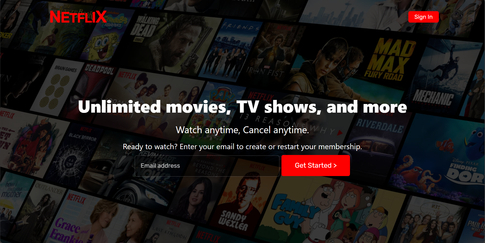

# 🎬 Netflix Clone

A simple **Netflix landing page clone** built with **HTML** and **CSS**, inspired by Netflix’s sleek design.

 

## 📸 Screenshots

 

## 🚀 Features

✅ Custom Netflix-style logo  
✅ Responsive layout  
✅ Background image with overlay  
✅ Styled sign-in button with hover effects  
✅ Email input and CTA button with clean form design

 

## 🛠️ Tech Stack

- HTML  
- CSS (including Google Fonts & Netflix font)  
- Responsive design using media queries

 

## 💡 How to Use

1. Clone this repository: https://github.com/Mubeen-Channa/Netflix-Clone
2. Open `index.html` in your browser.

 

## ✨ Acknowledgments

Inspired by the official Netflix landing page design.

 

Feel free to fork, improve, and share!  
⭐ **Give this repo a star if you liked it!**

